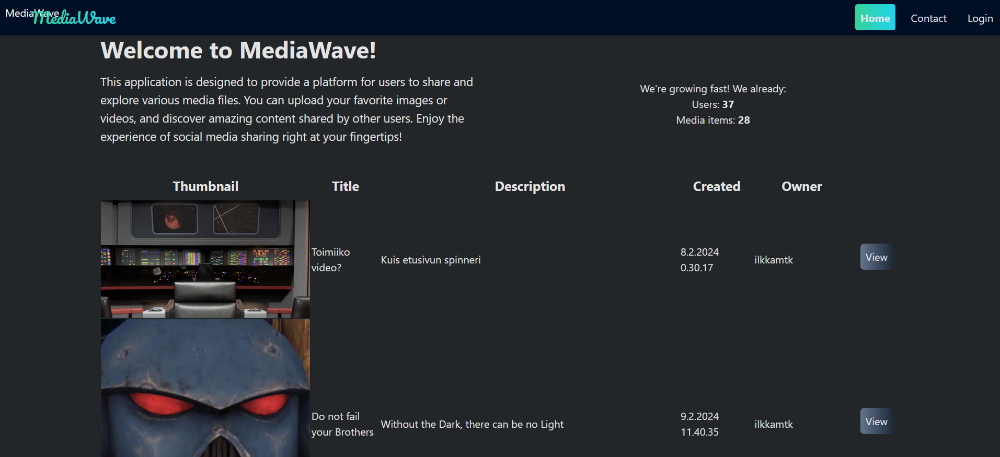
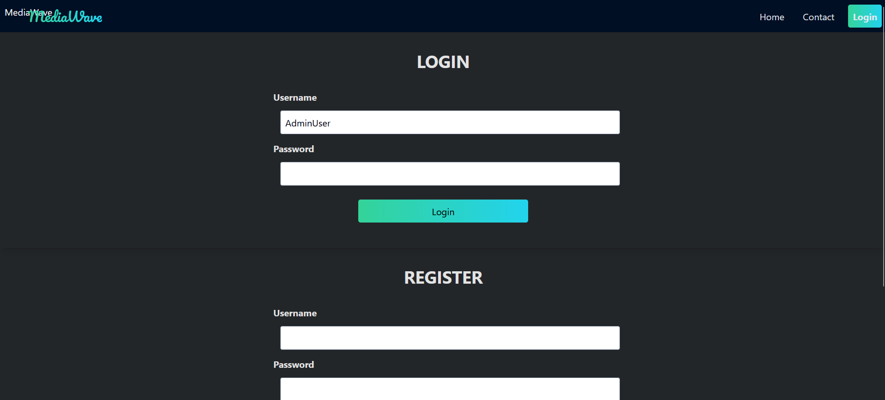
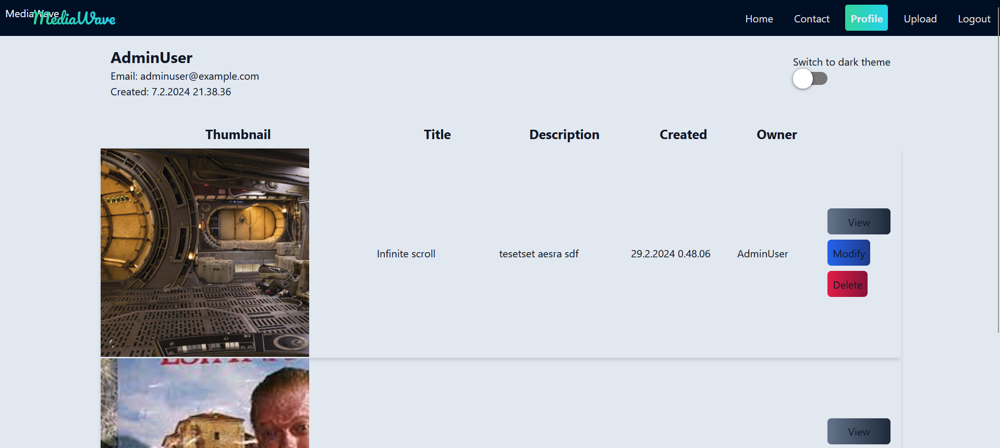
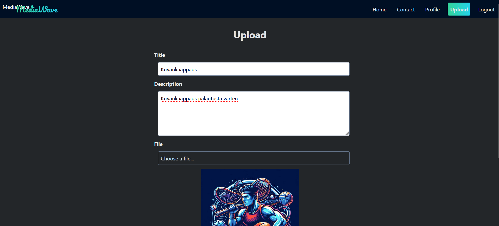
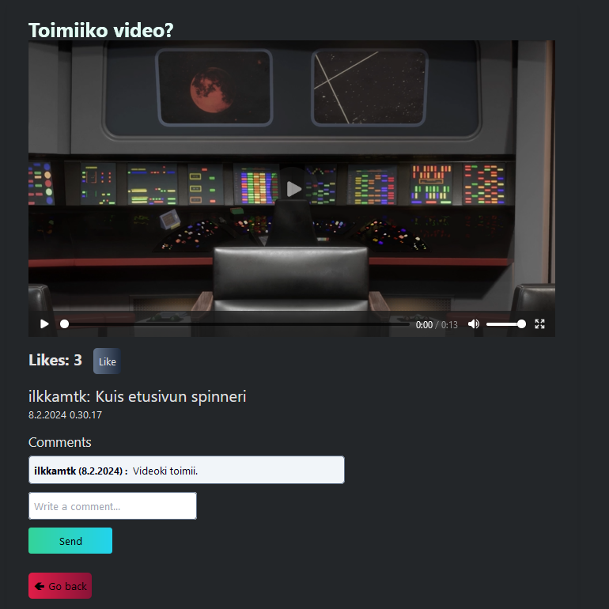
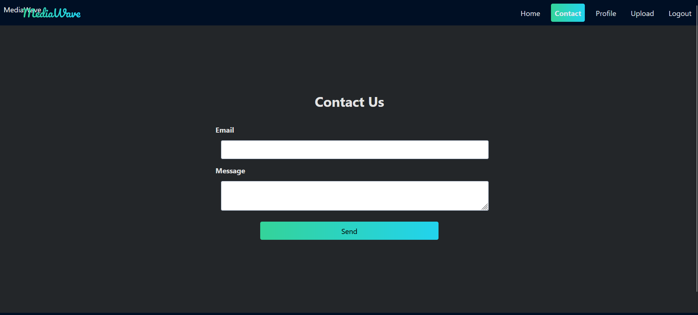
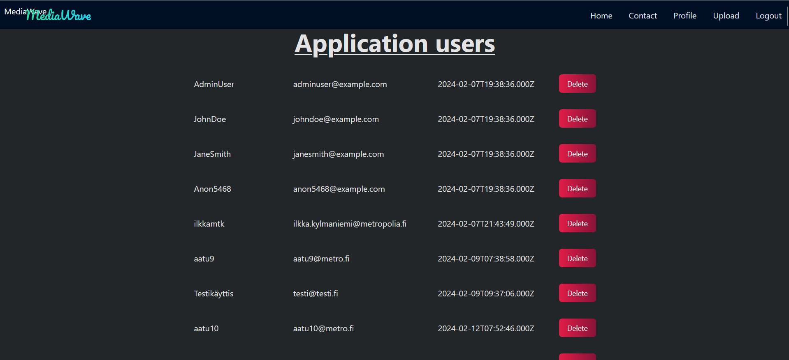

# Hybridisovellukset-projekti - MediaWave

## Julkaistu sovellus

Oma Metropolia: [Oma Metropolia](https://users.metropolia.fi/~henriole/hybridisovellukset/Project-new/)

Vercel: [Vercel](https://hybrid-project-mediawave.vercel.app/)

Azure: [Azure](http://20.123.94.38/)

## Back-end-sovellus/API

Linkki käytössä olevaan back-end-sovellukseen/APIin: [Back-endin nimi](https://www.example.com/api)

## API-dokumentaatio

Linkki API-dokumentaatioon (apidoc): [API-dokumentaatio](https://www.example.com/api-docs)

## Tietokannan kuvaus

Tietokantana käytetty esimerkkipalvelimella olevaa tietokantaa.

## Toiminnallisuudet

- Kirjautuminen ja rekisteröityminen
- Profiilin hallinta (muokkaus, poisto)
- Tietojen hakeminen ja näyttäminen
- jne.

## Tiedossa olevat bugit/ongelmat

- Sovellus toimii tällä hetkellä vain Metropolian verkossa.
- Chromella lähtökohtaisesti ongelmia toiminnan kanssa, ellei mene ensin esimerkkipalvelimelle (https://10.120.32.94/auth-api/api/v1) ja kirjoita siellä "thisisunsafe"
- PWA ei toimi esimerkkipalvelimella olevien sertifikaattipuutteiden vuoksi.

## Referenssit ja käytetyt teknologiat

- React
- TypeScript
- JavaScript

## Kuvakaappaukset

## Home

## Login

## Profile

## Upload

## Single

## Contact

## Admin

