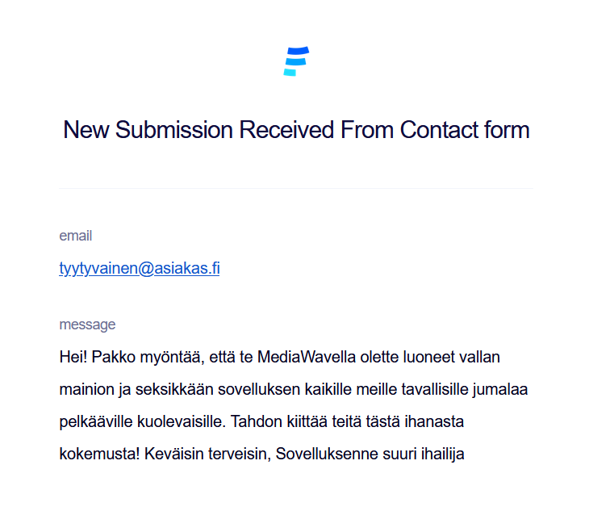

# Hybridisovellukset-projekti - MediaWave

## Julkaistu sovellus

Vercel: https://hybrid-project-mediawave.vercel.app/

Azure: http://20.123.94.38/

Backup: https://users.metropolia.fi/~henriole/hybridisovellukset/Project-new/

## Back-end-sovellus/API

Back-end-sovellus/API:

- [Upload](https://10.120.32.94/upload/api/v1)
- [Media-api](https://10.120.32.94/media-api/api/v1)
- [Auth-api](https://10.120.32.94/auth-api/api/v1)

## API-dokumentaatio

API-dokumentaatio (apidoc): [API-dokumentaatio](https://10.120.32.94/media-api/)

## Tietokannan kuvaus

Tietokantana käytetty esimerkkipalvelimella olevaa tietokantaa.

## Toiminnallisuudet

- Kirjautuminen ja rekisteröityminen
- Kuvien ja videoiden lataaminen
- Kuvien ja videoiden katselu
- Kuvien ja videoiden poistaminen
- Kuvien ja videoiden tykkääminen
- Kuvien ja videoiden kommentointi
- dark/light mode
- Admin-näkymä, jossa voi poistaa käyttäjiä ja kuvia
- Yhteydenottolomake
- PWA
- Analytiikkaa käyttäjä- ja kuvamääristä

## Tiedossa olevat bugit/ongelmat

- Sovellus toimii tällä hetkellä vain Metropolian verkossa.
- Chromella lähtökohtaisesti ongelmia toiminnan kanssa, ellei mene ensin esimerkkipalvelimelle (https://10.120.32.94/auth-api/api/v1) ja kirjoita siellä "thisisunsafe".
- PWA ei toimi esimerkkipalvelimella olevien sertifikaattipuutteiden vuoksi(?).

## Käytetyt teknologiat

- React
- TypeScript
- JavaScript

# Kuvakaappaukset

## Home

## Login

## Profile

## Upload

## Single

## Contact

## Contact - Submitted (vastaanotettu lomake)

## Admin

